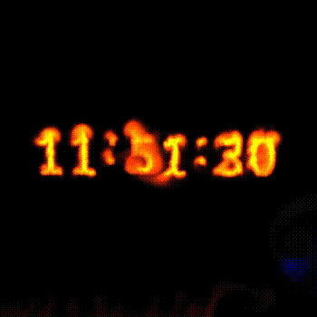

# Stable-Fluids
This is the implementation of *Stable Fluids* by Jos Stam at SIGGRAPH 1999.

Only tested on Linux

## Requires
* fftw3f: http://www.fftw.org/fftw-3.3.9.tar.gz
 * configure with --enable-float
* GLFW

## Screenshots

